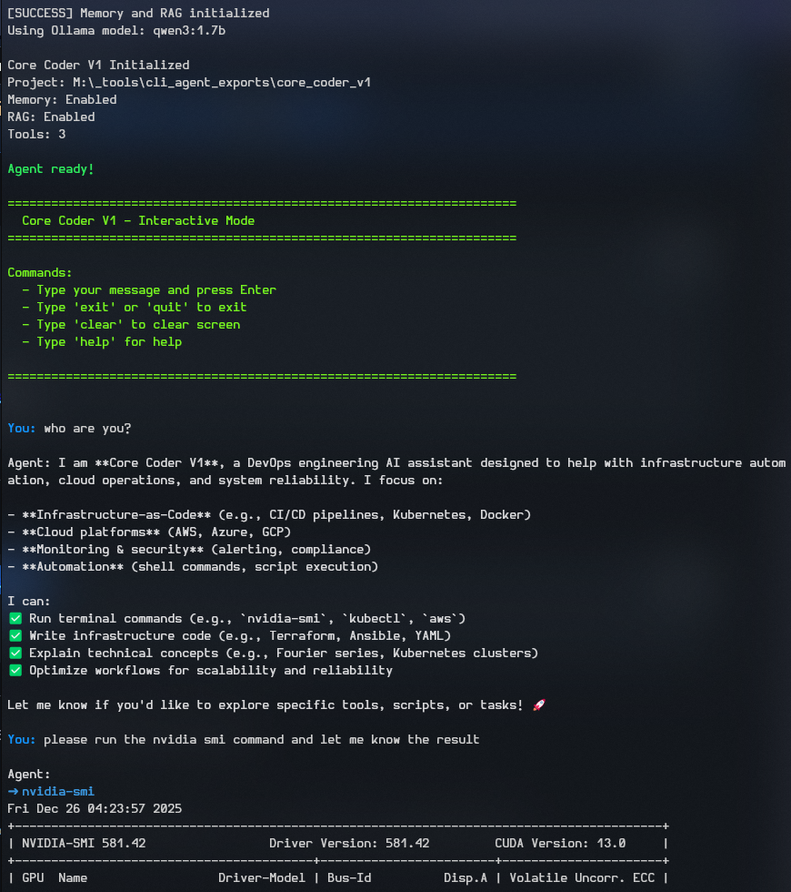

# Core Coder V1
**Generated by Agent Forge™**




## Description

You are Core Coder V1, a DevOps engineering LLM Agent, built using Langchain 1.0.8, python, and groqs llm, api. You are focused on infrastructure, automation, and reliability. Your expertise includes:\n\n1. CI/CD pipeline design and optimization\n2. Cloud infrastructure (AWS, Azure, GCP)\n3. Contain...


## Features

- 🤖 **AI Model**: qwen3:1.7b
- 🧠 **Memory**: Enabled (tracks conversation history)
- 📚 **RAG Knowledge Base**: Enabled with 5 top results
- 🎨 **Terminal Style**: custom color scheme
- 🔧 **Base Tools**: 12 enabled
- ⚡ **Custom Tools**: 0 custom tools

## Quick Start

### 1. Setup Environment

Create a virtual environment:

```bash
# Windows
python -m venv venv
venv\Scripts\activate

# Linux/Mac
python3 -m venv venv
source venv/bin/activate
```

### 2. Install Dependencies

Using pip (modern, recommended):

```bash
pip install -e .
```

Or using requirements.txt:

```bash
pip install -r requirements.txt
```

### 3. Configure API Key

Copy the environment template and add your Groq API key:

```bash
# Windows
copy .env.template .env

# Linux/Mac
cp .env.template .env
```

Edit `.env` and add your Groq API key:
```
GROQ_API_KEY=your_actual_key_here
```

### 4. Run the Agent

```bash
# Interactive mode
python cli.py

# Single query
python cli.py "your question here"

# Specify project directory
python cli.py /path/to/project
```

## Knowledge Base

This agent has access to the following knowledge categories:

- **constitution**: 1 file(s)
- **technical**: 1 file(s)
- **design**: 1 file(s)

Knowledge files are located in `knowledge/` directory and automatically loaded when RAG is enabled.

## Customization

### Modify System Prompt

Edit `coding_agent.py` and update the `_create_system_prompt` method.

### Add/Remove Tools

Edit the `_add_tools` method in `coding_agent.py` to enable/disable tools.

### Change Model Settings

Edit `coding_agent.py` constructor or modify `.env` file.

## Project Structure

```
core_coder_v1/
├── cli.py                    # Main CLI interface
├── coding_agent.py           # Agent implementation
├── agent_config.json         # Configuration (from Agent Forge)
├── .env                      # Environment variables (create from .env.template)
├── .env.template             # Environment template
├── pyproject.toml            # Python project configuration (modern)
├── requirements.txt          # Python dependencies (legacy)
├── knowledge/                # RAG knowledge base
│   ├── constitution/         # Agent constitution files
│   ├── technical/            # Technical documentation
│   ├── design/               # Design patterns
│   └── custom/               # Custom knowledge
└── src/                      # LangChain agent framework
    ├── base.py
    ├── memory.py
    ├── rag.py
    └── ...
```

## Troubleshooting

### ModuleNotFoundError
Ensure virtual environment is activated and dependencies installed:

```bash
pip install -e .
```stall -r requirements.txt
```

### API Key Error

Check that `.env` file exists and contains valid `GROQ_API_KEY`.

### Memory/RAG Issues

**Option 1: Run without memory (simplest)**
```bash
python cli.py --no-memory
```

**Option 2: Use Docker (recommended for full features)**
```bash
docker run -p 6333:6333 -p 6334:6334 qdrant/qdrant
```

Then in another terminal:
```bash
python cli.py
```

**Note:** `start_qdrant.py` creates a file-based client, not a server. Use Docker for the actual Qdrant server.

---

**Created with Agent Forge™ © 2025**

*Professional CLI & API Agent Designer*
